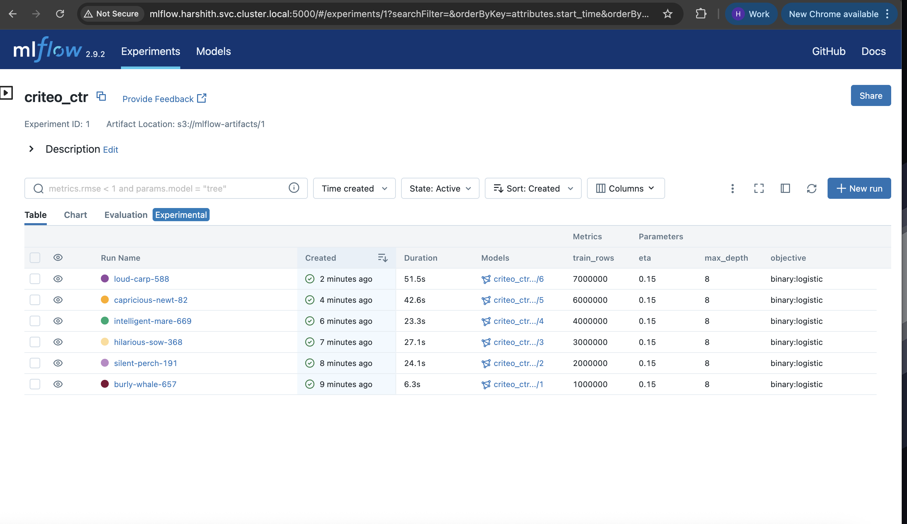
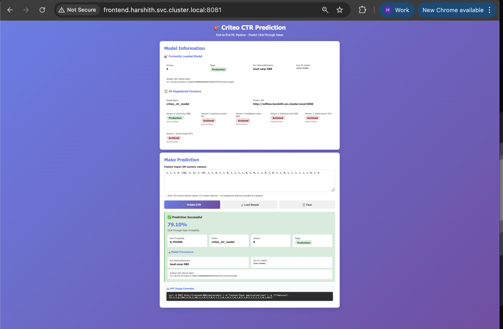
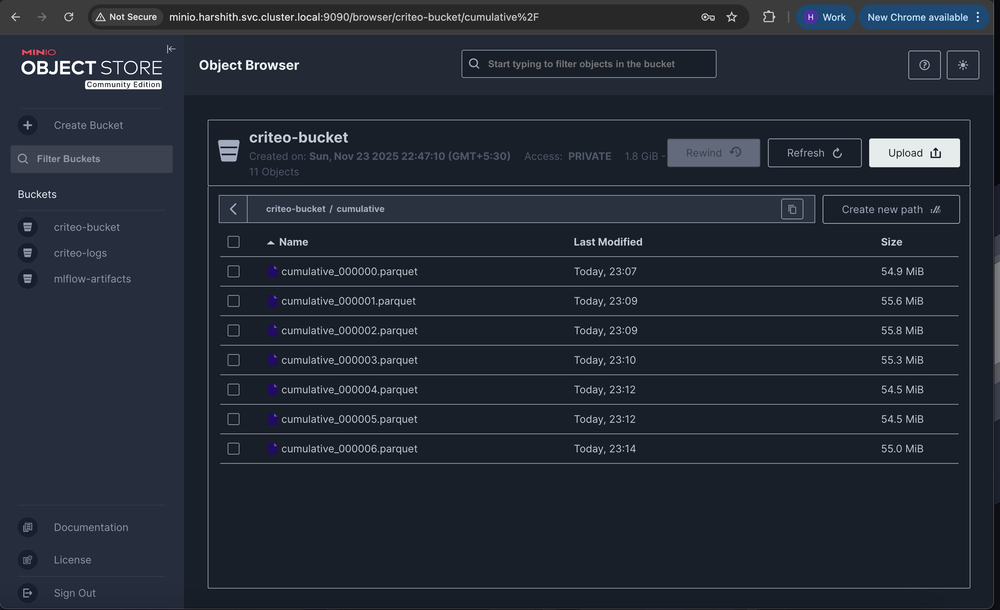

# 🚀 ETE-ML-PIPELINE

**End-to-End ML Pipeline** - Production-ready MLOps system for continuous model training and deployment with full provenance tracking.

---

## 📸 Screenshots & Demo








<!-- TODO: Add demo video link -->
🎥 [Watch Demo Video](docs/videos/demo.mp4)

---

## 🎯 What This Project Does

An automated machine learning pipeline that:
- **Ingests data** continuously from Criteo CTR dataset
- **Trains XGBoost models** automatically every 10 minutes
- **Tracks experiments** and manages model versions with MLflow
- **Deploys models** automatically to production with BentoML
- **Serves predictions** through a user-friendly web interface
- **Provides full traceability** - every prediction shows which exact model (version, run ID, artifact path) generated it

**Use Case**: Predicting Click-Through Rates (CTR) for online advertising

---

## 🏗️ Architecture Overview

```
┌─────────────────────────────────────────────────────────────────┐
│                    DATA INGESTION & PROCESSING                  │
└─────────────────────────────────────────────────────────────────┘
                               │
                               ▼
┌──────────────┐        ┌──────────────┐        ┌──────────────┐
│   Airflow    │───────▶│    MinIO     │───────▶│   MLflow     │
│ (Orchestrate)│        │  (Storage)   │        │  (Registry)  │
└──────────────┘        └──────────────┘        └──────────────┘
                               │                        │
                               │                        │
                               ▼                        ▼
                        ┌──────────────┐        ┌──────────────┐
                        │  PostgreSQL  │        │   BentoML    │
                        │  (Metadata)  │        │  (Serving)   │
                        └──────────────┘        └──────────────┘
                                                       │
                                                       ▼
                                                ┌──────────────┐
                                                │   Frontend   │
                                                │   (FastAPI)  │
                                                └──────────────┘
```

**Flow**: Raw Data → Chunk → Parquet → Train → Register → Deploy → Predict

---

## 🚀 Quick Start (5 Minutes)

### Prerequisites
- Kubernetes cluster (minikube/kind/cloud)
- kubectl configured
- 4GB+ RAM available

### 1. Deploy Everything

```bash
# Clone the repo
cd mlpro

# Deploy all services
./main.sh start all

# Wait for pods (2-3 minutes)
watch kubectl get pods -n harshith
```

### 2. Access Services

```bash
# Terminal 1: Airflow
kubectl port-forward -n harshith svc/airflow-webserver 8080:8080

# Terminal 2: MLflow
kubectl port-forward -n harshith svc/mlflow 5000:5000

# Terminal 3: MinIO
kubectl port-forward -n harshith svc/minio 9090:9090

# Terminal 4: Frontend
kubectl port-forward -n harshith svc/frontend 8081:8081
```

**URLs:**
- Airflow: http://localhost:8080 (admin/admin)
- MLflow: http://localhost:5000
- MinIO: http://localhost:9090 (minio/minio123)
- Frontend: http://localhost:8081

### 3. Run the Pipeline

```bash
# Trigger the master pipeline in Airflow UI
# Or via CLI:
kubectl exec -n harshith deploy/airflow-scheduler -- \
  airflow dags trigger criteo_master_pipeline
```

**Wait 5-10 minutes for:**
- Data ingestion ✓
- Model training ✓
- Model registration ✓
- Auto-deployment ✓

### 4. Fix "Model not loaded" Issue

⚠️ **If frontend shows "Model not loaded":**

```bash
# Option 1: Reload BentoML (no restart)
kubectl exec -n harshith deploy/bento-svc -- \
  curl -X POST http://localhost:3000/reload -d '{}'

# Option 2: Restart BentoML service
./main.sh restart bento
```

This happens because BentoML starts before the first model is trained. After training completes, reload/restart picks up the model.

### 5. Make Predictions

1. Open http://localhost:8081
2. Click "📝 Load Sample" button
3. Click "🚀 Predict CTR"
4. See results with **full model provenance**!

---

## 🛠️ Pipeline Workflow

The `criteo_master_pipeline` DAG runs **every 10 minutes** and executes 4 tasks sequentially:

```
1. produce_chunk      → Download & chunk raw Criteo data
         ↓
2. build_cumulative   → Convert chunks to Parquet format
         ↓
3. train_model        → Train XGBoost, log to MLflow, register model
         ↓
4. reload_bento       → Hot-reload BentoML with new model (no restart!)
```

**Key Feature**: Each prediction shows:
- Model version (e.g., "3")
- Run name (e.g., "beautiful-trout-500")
- Run ID hash (matches MinIO artifact path)
- Exact S3 path where model is stored

---

## 🔧 Technologies Used

| Technology | Purpose | Why This Tech |
|-----------|---------|---------------|
| **Apache Airflow 2.10.1** | Workflow orchestration | Industry standard for ML pipelines, DAG-based scheduling |
| **MinIO** | S3-compatible object storage | Stores raw data, training data, model artifacts, logs |
| **MLflow 2.9.2** | Experiment tracking & model registry | Version control for ML models, lineage tracking |
| **BentoML 1.3.8** | Model serving | Fast model deployment, API generation, versioning |
| **FastAPI** | Frontend web framework | Modern Python web framework for ML APIs |
| **PostgreSQL 13** | Backend database | Stores Airflow & MLflow metadata |
| **XGBoost 2.0.3** | ML algorithm | Fast, accurate gradient boosting for CTR prediction |
| **Kubernetes** | Container orchestration | Scalable, production-ready infrastructure |
| **Docker** | Containerization | Consistent environments across dev/prod |
| **Python 3.11** | Programming language | Rich ML ecosystem, async support |

---

## 📁 Project Structure

```
mlpro/
├── README.md                    # This file
├── MASTER.md                    # Detailed technical documentation
├── main.sh                      # Service management script
├── sample_input_frontend.txt    # 20 test samples
│
├── infra-k8s/                   # Kubernetes manifests
│   ├── 0.namespace.yaml         # namespace: harshith
│   ├── 1.postgres.yaml          # PostgreSQL for Airflow + MLflow
│   ├── 2.airflow.yaml           # Airflow webserver + scheduler
│   ├── 2a.airflowconfigmaps.yaml # DAG: criteo_master_pipeline
│   ├── 2b.Minio.yaml            # MinIO S3-compatible storage
│   ├── 3.mlflow.yaml            # MLflow tracking + registry
│   ├── 4.bento.yaml             # BentoML serving (with ConfigMap)
│   └── 5.frontend.yaml          # FastAPI frontend
│
└── custom_dockerfiles/          # Custom Docker images
    ├── airflow/                 # Custom Airflow with ML deps
    ├── bento/                   # BentoML service
    └── frontend/                # Prediction UI
```

---

## 🎓 Key Features

### ✅ Full Automation
- Scheduled training every 10 minutes
- Automatic model registration
- Auto-promotion to Production stage
- Hot reload (no service restart needed)

### ✅ Model Provenance
Every prediction shows:
- Which model version
- Training run ID (hash)
- MLflow run name (e.g., "glamorous-goose-948")
- Exact MinIO artifact path

### ✅ Production-Ready
- Multi-platform Docker images (amd64/arm64)
- Kubernetes-native deployment
- S3-compatible artifact storage
- Graceful error handling
- Comprehensive logging

### ✅ User-Friendly
- Beautiful web UI for predictions
- One-click sample data loading
- Real-time model information
- Clear error messages

---

## 🔍 Common Commands

```bash
# Service Management
./main.sh start all              # Start everything
./main.sh stop airflow           # Stop a service
./main.sh restart bento          # Restart BentoML
./main.sh status all             # Check all services
./main.sh cleanup all            # Remove everything

# Kubernetes
kubectl get pods -n harshith                    # List pods
kubectl logs -n harshith -l app=airflow-scheduler  # Airflow logs
kubectl logs -n harshith -l app=bento-svc         # BentoML logs

# Airflow CLI
kubectl exec -n harshith deploy/airflow-scheduler -- \
  airflow dags list                             # List DAGs
kubectl exec -n harshith deploy/airflow-scheduler -- \
  airflow dags trigger criteo_master_pipeline   # Trigger pipeline
kubectl exec -n harshith deploy/airflow-scheduler -- \
  airflow dags unpause criteo_master_pipeline   # Unpause DAG
```

---

## 🐛 Troubleshooting

### "Model not loaded" in Frontend
**Solution**: Restart or reload BentoML after first training completes
```bash
./main.sh restart bento
```

### Airflow DAG not running
**Solution**: Check if DAG is unpaused and scheduler is running
```bash
kubectl exec -n harshith deploy/airflow-scheduler -- \
  airflow dags unpause criteo_master_pipeline
```

### Image pull errors
**Solution**: Images are multi-platform. Check platform compatibility:
```bash
kubectl describe pod <pod-name> -n harshith
```

### Training fails
**Solution**: Check logs and ensure MinIO has data
```bash
kubectl logs -n harshith -l app=airflow-scheduler --tail=100
```

---

## 📊 Noteworthy Highlights

- **End-to-end MLOps pipeline** with automated training, deployment, and serving
- **Kubernetes-native** infrastructure with 6 microservices
- **Full model lineage tracking** from training data to predictions
- **Production-grade** with error handling, logging, and monitoring
- **Scalable architecture** using industry-standard tools (Airflow, MLflow, BentoML)
- **Custom Docker images** with multi-platform support
- **RESTful APIs** for model serving and predictions
- **Real-time retraining** pipeline that runs every 10 minutes
- **S3-compatible storage** for artifacts and data versioning
- **Modern Python stack** (FastAPI, asyncio, type hints)

---

## 🔗 Links

- **Docker Hub**: https://hub.docker.com/u/harshith21
  - Airflow: `harshith21/ete-ml-pipeline-airflow:latest`
  - BentoML: `harshith21/ete-ml-pipeline-bento:latest`
  - Frontend: `harshith21/ete-ml-pipeline-frontend:latest`

- **Documentation**:
  - [MASTER.md](MASTER.md) - Detailed technical documentation
  - [Sample Inputs](sample_input_frontend.txt) - Test data for predictions

---

## 📝 License

MIT License

---

**ETE-ML-PIPELINE** - Production-grade MLOps pipeline demonstrating industry best practices 🚀

Built with ❤️ for learning and demonstration.
